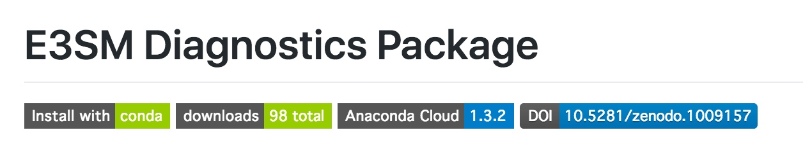

.. _run:

`Github version <https://github.com/kaizhangpnl/kaizhangpnl.github.io/blob/master/source/diag.rst>`_ 

`Spinx version <https://kaizhangpnl.github.io/EAM_User_Guide/diag.html>`_ 

Diagnostics Packages
====================

AMWG Diagnostics 
----------------

`NCAR resources <http://www.cesm.ucar.edu/working_groups/Atmosphere/amwg-diagnostics-package/>`_ 

Internal resources: 

- `How to run AMWG diagnostics package <https://acme-climate.atlassian.net/wiki/spaces/ATM/pages/41353486/How+to+run+AMWG+diagnostics+package>`_ 
- `AMWG Multiple Diagnostics View <https://acme-climate.atlassian.net/wiki/spaces/ATM/pages/29753895/AMWG+Multiple+Diagnostics+View>`_ 
- Diagnostics from beta0 simulations: 

  .. https://acme-climate.atlassian.net/wiki/spaces/SIM/pages/110788954/20161118.beta0.FC5COSP.ne30+ne30.edison
  `FC5AV1C-04P2 <http://portal.nersc.gov/project/acme/coupled/beta/20161118.beta0.FC5COSP.ne30_ne30.edison/0002-0011-vs-obs/>`_ 

  .. https://acme-climate.atlassian.net/wiki/spaces/SIM/pages/111673570/20161118.beta0.F1850COSP.ne30+ne30.edison
  `F1850C5AV1C-04P2 <http://portal.nersc.gov/project/acme/coupled/beta/20161118.beta0.F1850COSP.ne30_ne30.edison/0002-0011-vs-obs/>`_  

  .. https://acme-climate.atlassian.net/wiki/spaces/SIM/pages/111673554/20161118.beta0.F2000AFCOSP.ne30+ne30.edison
  `F20TR <http://portal.nersc.gov/project/acme/coupled/beta/20161118.beta0.F20TRCOSP.ne30_ne30.edison/1976-1999-vs-obs/>`_  
  

E3SM Diagnostics
----------------

   
See details `here <https://github.com/E3SM-Project/acme_diags>`_ 

.. Examples from DECK Simulations (internal): 
.. 
.. http://portal.nersc.gov/project/acme/coupled/DECKv1/20180215.DECKv1b_H1.ne30_oEC.edison/e3sm_diags/1985-2014/viewer/index.html

ARM Diagnostics 
----------------

See details `here <https://github.com/ARM-DOE/arm-gcm-diagnostics>`_ 

