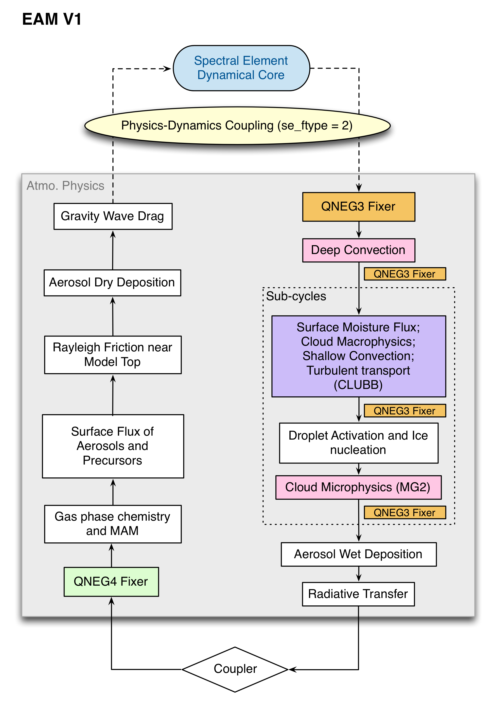

.. _flow:

Technical overview of EAM 
=========================

`Github  <https://github.com/kaizhangpnl/kaizhangpnl.github.io/blob/master/source/flow.rst>`_ 
`Spinx  <https://kaizhangpnl.github.io/EAM_User_Guide/flow.html>`_ 

Flow Chart
----------

   Diagrams showing the sequence of calculation (i.e., the time integration loop) in EAM. 
   The blue stadium shapes refer to the resolved-scale dynamics and transport, and 
   the diamonds refer to the exchange of mass and energy with other model components 
   (e.g., land and ocean) through the coupler. The rectangular cells are parts of the 
   physics package that describe the subgrid-scale physical and chemical processes. 
   The colored boxes indicate parts of EAM that affect the concentrations of water 
   species; these include the numerical fixers, deep and shallow convection, 
   turbulent transport, and stratiform cloud macro- and microphysics. 
   See `Zhang et al. (2018) <https://www.geosci-model-dev-discuss.net/gmd-2017-293/>`_ for more details. 
   
   
Spatial resolution
----------------

Technically, EAM can run with horizontal resolution from ne4 (about 750km) to ne120 (about 25km)
(with F1850C5AV1C-04P2 compset).

The vertical resolution is L30 (`lev <./L30.html>`_) for V0 and L72  (`lev <./L72.html>`_) for V1. 
Detailed information about the vertical coordinate in EAMv1 can be found 
`here <https://github.com/kaizhangpnl/kaizhangpnl.github.io/blob/master/source/levels.txt>`_ 

   
List of advective tracers 
-------------------------

- `List of advective tracers in EAMv1 <https://github.com/kaizhangpnl/kaizhangpnl.github.io/blob/master/source/tracers_adv.txt>`_ : :: 

         Name      Description                                   Type
         ------    ----------------------------------------      ----- 
     1   Q         Specific humidity                             wet
     2   CLDLIQ    Grid box averaged cloud liquid amount         wet
     3   CLDICE    Grid box averaged cloud ice amount            wet
     4   NUMLIQ    Grid box averaged cloud liquid number         wet
     5   NUMICE    Grid box averaged cloud ice number            wet
     6   RAINQM    Grid box averaged rain amount                 wet
     7   SNOWQM    Grid box averaged snow amount                 wet
     8   NUMRAI    Grid box averaged rain number                 wet
     9   NUMSNO    Grid box averaged snow number                 wet
     10  O3        O3                                            dry
     11  H2O2      H2O2                                          dry
     12  H2SO4     H2SO4                                         dry
     13  SO2       SO2                                           dry
     14  DMS       DMS                                           dry
     15  SOAG      SOAG                                          dry
     16  so4_a1    so4_a1                                        dry
     17  pom_a1    pom_a1                                        dry
     18  soa_a1    soa_a1                                        dry
     19  bc_a1     bc_a1                                         dry
     20  dst_a1    dst_a1                                        dry
     21  ncl_a1    ncl_a1                                        dry
     22  mom_a1    mom_a1                                        dry
     23  num_a1    num_a1                                        dry
     24  so4_a2    so4_a2                                        dry
     25  soa_a2    soa_a2                                        dry
     26  ncl_a2    ncl_a2                                        dry
     27  mom_a2    mom_a2                                        dry
     28  num_a2    num_a2                                        dry
     29  dst_a3    dst_a3                                        dry
     30  ncl_a3    ncl_a3                                        dry
     31  so4_a3    so4_a3                                        dry
     32  bc_a3     bc_a3                                         dry
     33  pom_a3    pom_a3                                        dry
     34  soa_a3    soa_a3                                        dry
     35  mom_a3    mom_a3                                        dry
     36  num_a3    num_a3                                        dry
     37  pom_a4    pom_a4                                        dry
     38  bc_a4     bc_a4                                         dry
     39  mom_a4    mom_a4                                        dry
     40  num_a4    num_a4                                        dry

- `List of advective tracers in EAMv0 <https://github.com/kaizhangpnl/kaizhangpnl.github.io/blob/master/source/tracers_adv_EAMv0.txt>`_

List of tuning parameters 
-------------------------

Below is a list of parameters that are often tuned in EAM. 
Note that only V1 has CLUBB-related parameters.
The csv file is available `here <https://github.com/kaizhangpnl/kaizhangpnl.github.io/blob/master/source/tuning_parameters.csv>`_. 

.. csv-table:: 
   :widths: 15 30 10 10
   :header: "Parameter", "Description", "EAM V0", "EAM V1"
   :file: tuning_parameters.csv

